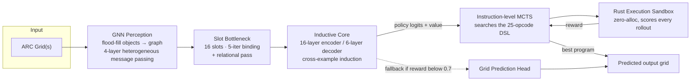

<div align="center">

# 恵雷 Eunoia Raiden

**A ~354M-parameter reasoning engine built to beat every model on the planet at ARC-AGI — not by scale, but by architecture.**

[](#-architecture)
[](#-the-dsl)
[](#-the-execution-sandbox)
[](#-license)

*SHV Groups AGI Research Division · Eunoia Labs*

</div>

---

## Table of Contents

- [Vision](#-vision)
- [Targets](#-targets)
- [How it works, in one picture](#-how-it-works-in-one-picture)
- [Architecture](#-architecture)
  - [GNN Perception](#1-gnn-perception--core%2Fgnn_perceptionpy)
  - [Slot Attention Bottleneck](#2-slot-attention-bottleneck--core%2Fslot_attentionpy)
  - [Inductive Core](#3-inductive-core--core%2Finductive_corepy)
- [The DSL](#-the-dsl)
- [The Execution Sandbox](#-the-execution-sandbox)
- [Search: Instruction-Level MCTS](#-search-instruction-level-mcts)
- [Training Pipeline](#-training-pipeline)
- [Synthetic Data Factory](#-synthetic-data-factory)
- [Evaluation](#-evaluation)
- [Repository Structure](#-repository-structure)
- [Getting Started](#-getting-started)
- [Usage](#-usage)
- [GPU Profiles](#-gpu-profiles)
- [Live Architecture Dashboard](#-live-architecture-dashboard)
- [Roadmap](#-roadmap)
- [Contributing](#-contributing)
- [License](#-license)

---

## 🎯 Vision

Most ARC-AGI attempts throw enormous general-purpose LLMs at the problem and hope in-context reasoning gets them there. **Eunoia Raiden takes the opposite bet**: a small (~354M parameter), purpose-built architecture that perceives a grid as a graph of objects, binds those objects into a fixed set of reasoning slots, and *searches* over a compact domain-specific program space to find the exact transformation that solves a task — rather than trying to generate a full solution grid in one shot.

The thesis: **ARC-AGI is a program-induction problem wearing a computer-vision costume.** Solve the induction problem with the right inductive biases, and you don't need hundreds of billions of parameters.

## Targets

| Benchmark | Target Accuracy | Status |
|---|---|---|
| ARC-AGI-1 | **98–99%** | 🔲 Phase 2 in progress |
| ARC-AGI-2 | **90–95%** | 🔲 Phase 3 pending |
| ARC-AGI-3 *(upcoming)* | **85–90%** | 🔲 Not started |

## How it works, in one picture



Every training pair and the test input are pushed through the **same** perception → bottleneck pipeline, then all pairs are concatenated into one joint sequence so the encoder can perform genuine **cross-example induction** — attending across all three demonstrations at once to infer the shared rule, before the decoder autoregressively emits a DSL program.

## Architecture

Real, live-introspected parameter counts (see [Live Architecture Dashboard](#-live-architecture-dashboard) — these numbers are generated from the actual `nn.Module` tree, not hand-typed):

| Component | File | Parameters | Share |
|---|---|---:|---:|
| **Inductive Core** | `core/inductive_core.py` | 324,458,409 | 91.7% |
| **GNN Perception** | `core/gnn_perception.py` | 25,273,856 | 7.1% |
| **Slot Bottleneck** | `core/slot_attention.py` | 4,218,368 | 1.2% |
| **Total** | | **353,950,633** | 100% |

### 1. GNN Perception — `core/gnn_perception.py`

Every grid is parsed into a graph, not a pixel tensor:

1. **Flood-fill segmentation** (`GridParser`) turns the raw grid into discrete objects (connected components of same-colored, non-background cells).
2. Each object becomes a **128-dim node feature vector** — color one-hot, normalized position/bbox, aspect ratio, perimeter/area ratio, and a 6×6 occupancy histogram of its own shape.
3. Objects are connected by **6 typed edges**: `ADJACENT`, `INSIDE`, `ALIGNED_H`, `ALIGNED_V`, `SAME_COLOR`, `SAME_SIZE`.
4. A **4-layer heterogeneous message-passing network** (512-dim hidden, one learned MLP per edge type, GRU-gated updates, LayerNorm) propagates relational information between objects.

Output: `[N_objects, 512]` — one embedding per object, relationally aware of every other object on the grid.

### 2. Slot Attention Bottleneck — `core/slot_attention.py`

Variable numbers of objects get bound into a **fixed set of 16 slots** via iterative slot attention (5 binding iterations, softmax-over-slots competition, GRU slot updates) — this is what lets the Inductive Core operate over a constant-size representation regardless of how many objects are on the grid. A **relational self-attention pass** across the 16 slots follows, so slots can directly compare "my object vs. your object" before being handed to the reasoning core.

Output: `slots [16, 512]` + a negative entropy loss term (minimized to *maximize* attention diversity across slots, preventing slot collapse).

### 3. Inductive Core — `core/inductive_core.py`

The reasoning engine, and 92% of the parameter budget:

- **`IOSlotEmbedder`** projects 512-dim slots to 1024-dim and adds three learned positional signals: modality (input vs. output), pair index (0–3), and slot position.
- **16-layer Transformer encoder** (1024-dim, 16 heads, FFN=4096, pre-norm) ingests all 3 training pairs *and* the test input as one joint sequence — this is where cross-example induction happens.
- **6-layer Transformer decoder** autoregressively emits a DSL program, token by token, cross-attending to the encoder's induced representation.
- **Policy head** → next-token logits over the 128-token DSL vocabulary.
- **Value head** → scalar reward estimate for the current program-so-far (feeds MCTS's Q-values).
- **Grid Prediction Head** → a direct-to-pixels fallback used when MCTS can't find a program scoring above 0.7 reward (catches task types outside current DSL coverage).

## The DSL

A **25-opcode instruction set** (plus a `HALT` terminator) designed to cover the empirically most common ARC transformation patterns — translate, reflect, rotate, gravity, symmetry completion, flood fill, masking, ranking by size/color, conditional branching, and more. Full opcode table lives in `dsl/primitives.py`; the byte-level encoding contract is mirrored exactly in `dsl/src/lib.rs` (Rust) so both languages execute identically.

<details>
<summary><b>Full opcode table</b></summary>

| Opcode | Byte | Args | Description |
|---|---|---|---|
| `TRANSLATE` | `0x01` | obj_id, dr, dc | Shift an object by (dr, dc) |
| `REFLECT` | `0x02` | obj_id, axis | Mirror across H / V / diag / anti-diag |
| `ROTATE` | `0x03` | obj_id, turns | Rotate 90°×turns about centroid |
| `SHIFT_UNTIL_CONTACT` | `0x04` | obj_id, dir | Slide until it hits something |
| `FILL_COLOR` | `0x05` | obj_id, color | Recolor an object |
| `COPY_COLOR_FROM` | `0x06` | src_id, dst_id | Copy one object's color to another |
| `SWAP_COLORS` | `0x07` | c1, c2 | Swap two colors grid-wide |
| `COUNT_OBJECTS` | `0x08` | filter, reg | Count objects (optionally by color) into a register |
| `GET_SIZE` | `0x09` | obj_id, reg | Object cell count → register |
| `FILTER_BY_SIZE` | `0x0A` | min, max, reg | Count objects within a size range |
| `IF_THEN` | `0x0B` | reg, thresh, then_off, else_off | Conditional relative jump |
| `DUPLICATE` | `0x0C` | obj_id, dr, dc | Clone an object at an offset |
| `SCALE` | `0x0D` | obj_id, factor | Integer up-scale about centroid |
| `GRAVITY` | `0x0E` | dir | All objects fall until blocked |
| `SYMMETRY_COMPLETE` | `0x0F` | obj_id, axis | Mirror-complete across grid center |
| `RECOLOR_BY_RANK` | `0x10` | reg | Recolor objects by size rank |
| `FLOOD_FILL_BG` | `0x11` | color | Fill all background cells |
| `GET_COLOR` | `0x12` | obj_id, reg | Object color → register |
| `FILTER_BY_COLOR` | `0x13` | color, reg | Count objects of a given color |
| `HOLLOW` | `0x14` | obj_id | Keep only an object's boundary cells |
| `BORDER` | `0x15` | obj_id, color | Draw a 1-cell border around its bbox |
| `EXTEND` | `0x16` | obj_id, dir | Grow an object by 1 cell in a direction |
| `MASK_AND` | `0x17` | src1, src2, color | New object = intersection of two |
| `MASK_OR` | `0x18` | src1, src2, color | New object = union of two |
| `MOVE_TO` | `0x19` | obj_id, r, c | Move object's top-left to an absolute position |
| `HALT` | `0xFF` | — | End of program |

</details>

**22 relationship templates** (`RELATIONSHIP_TEMPLATES`) compose these opcodes into semantically coherent programs — e.g. `dynamic_collision = [SHIFT_UNTIL_CONTACT, FILL_COLOR]`, `symmetry = [SYMMETRY_COMPLETE]` — used by the synthetic data generator to produce naturalistic (not random-noise) training programs.

## The Execution Sandbox

`dsl/src/lib.rs` — a zero-allocation Rust interpreter (PyO3 bindings via `insgr_rust`), compiled with `opt-level=3`, LTO, single codegen unit. Grids are packed 2-per-byte (4-bit nibbles, since ARC only ever needs colors 0–9) into a fixed 450-byte buffer — no heap allocation per cell. A `DashMap`-backed task arena lets many parallel MCTS rollouts hold live task handles concurrently without lock contention.

Reward function (identical semantics in both Rust and the Python reference executor used for data generation):

```
R = 0.3 · [syntax_valid]  +  0.5 · (correct_cells / total_cells)  +  0.2 · [exact_match]
```

Build it with:

```bash
python dsl/build.py    # runs `maturin develop --release`
```

## Search: Instruction-Level MCTS

`engine/mcts_search.py` — the key departure from a naive byte-level search: **every MCTS action is a complete `(opcode, args)` instruction**, not a single byte. This collapses the branching factor from 256 (raw bytes) down to the DSL's opcode count, and guarantees every node in the search tree is syntactically valid — no wasted rollouts on malformed programs.

- **Selection**: UCB1 with a learned prior (`c_puct` weighted, prior comes from the policy head)
- **Expansion**: top-K (default 8) highest-prior opcodes, with sampled arguments
- **Evaluation**: score against all training pairs via the Rust sandbox
- **Early exit**: stops the instant a program achieves exact match on every training pair
- **Budget**: 50 rollouts during Phase 2 training, up to 12,500 at inference (with 8-way test-time augmentation, ≈1,562 per augmentation)

## Training Pipeline

Three phases, each targeting a different failure mode:

| Phase | Name | Data | Method | Key hyperparameters |
|---|---|---|---|---|
| **1** | The Apprentice | ~2M synthetic Reverse-ARC tasks | Supervised (policy + value + entropy loss), curriculum by complexity bin | lr `1e-4`, grad-accum 256–512, 3 epochs, 20K warmup steps |
| **2** | The Reasoner | Real ARC-AGI-1 (400 tasks + augmentations) | MCTS-in-the-loop REINFORCE, EMA baseline | lr `2e-5`, 50 rollouts/task, `c_puct=0.5`, 4 tasks/step |
| **3** | The Champion | ARC-AGI-2 style harder tasks | Same as Phase 2, higher exploration | lr `1e-5`, 100 rollouts/task, `c_puct=0.8`, 5,000 steps |

Config dataclasses live in `training/config.py`; all three phases share one `TrainingConfig` and adapt automatically to whichever `--gpu` profile you select.

## Synthetic Data Factory

`factory/reverse_generator.py` generates **(task, ground-truth program)** pairs by working backwards — sample a grid, sample a relationship-template program, execute it, and keep the (input, output) pair — aligned to the real ARC distribution across **five dimensions**:

1. **Grid size** — empirical histogram (3×3 up to 20×20)
2. **Object count** — empirical histogram (1–8 objects)
3. **Color semantics** — color `0` is *always* background (Zero-Constraint)
4. **Program naturalness** — composed from the 22 relationship templates, not random opcode soup
5. **Complexity distribution** — binned 1–5 by `depth × unique_primitives × objects_referenced`, driving the Phase 1 curriculum

`factory/dataset_builder.py` parallelizes generation across workers and writes snappy-compressed Parquet shards; `factory/arc_loader.py` loads the 400 official ARC tasks and expands them ~8× via geometric + color-permutation augmentation.

## Evaluation

`eval/arc_evaluator.py` — full evaluation with two techniques stacked:

- **Test-Time Augmentation (8×)**: identity, rot90/180/270, flip-H, flip-V, 2× random color permutation. Runs every task in all 8 orientations and keeps whichever program scores highest — effectively 8× the search coverage for free.
- **Hybrid fallback**: if the best MCTS program scores below `0.7` reward, fall back to the `grid_head`'s direct pixel prediction — catches task types the current DSL doesn't cover well.

## Repository Structure

```
eunoia-raiden/
├── core/                     # The 354M-param model
│   ├── gnn_perception.py     #   GridParser + 4-layer heterogeneous GNN
│   ├── slot_attention.py     #   16-slot binding + relational pass
│   └── inductive_core.py     #   16+6 layer encoder/decoder, policy+value+grid heads
│
├── dsl/                      # The program language
│   ├── primitives.py         #   OpCode enum, byte encoding, arg sampling
│   ├── src/lib.rs             #   Rust interpreter (mirrors primitives.py exactly)
│   ├── Cargo.toml
│   └── build.py               #   `maturin develop --release` wrapper
│
├── engine/                   # Search + execution
│   ├── mcts_search.py         #   Instruction-level MCTS
│   ├── sandbox.py             #   Python ↔ Rust FFI wrapper
│   └── shaped_reward.py       #   Reward decomposition for logging
│
├── factory/                  # Synthetic data generation
│   ├── reverse_generator.py   #   5-dimension empirically-aligned task generator
│   ├── dataset_builder.py     #   Parallel generation → Parquet shards
│   └── arc_loader.py          #   Real ARC task loading + augmentation
│
├── training/
│   ├── config.py               #   Phase 1/2/3 configs + GPU profiles
│   ├── losses.py               #   Policy / value / REINFORCE losses
│   ├── phase1_trainer.py       #   Supervised trainer
│   └── phase2_trainer.py       #   MCTS-REINFORCE trainer (reused for Phase 3)
│
├── eval/
│   └── arc_evaluator.py        #   TTA + hybrid-fallback evaluation
│
├── visualize/                 # Live architecture dashboard (see below)
│   ├── introspect.py
│   ├── dashboard.html
│   ├── neuralnet.html
│   └── server.py
│
├── train.py                    # Main entrypoint — CLI for all phases
├── smoke_test.py                # 6-stage pre-flight check (run before renting a GPU)
├── ablation.py                  # MCTS / relational-pass ablation harness
├── check_params.py              # Quick param-count sanity check
└── requirements.txt
```

## Getting Started

```bash
# 1. Clone and install Python dependencies
git clone <repo-url> eunoia-raiden && cd eunoia-raiden
pip install -r requirements.txt

# 2. Build the Rust execution sandbox (required before any training/eval)
python dsl/build.py

# 3. Run the full smoke test — all 6 checks must pass before you rent a GPU
python smoke_test.py
```

Expected smoke test runtime: ~60–90 seconds on CPU. It verifies DSL serialization, the flood-fill parser, the GNN forward pass, slot attention, a full end-to-end model forward pass, and the synthetic generator — in that order.

## Usage

```bash
# Full pipeline (Phase 1 → 2 → 3 → final TTA evaluation)
python train.py --gpu h100

# Just count parameters, no training
python train.py --count-params

# Generate synthetic data ahead of time
python train.py --generate-data --num-tasks 2000000

# Run a single phase
python train.py --phase 1
python train.py --phase 2 --resume checkpoints/phase1_final.pt
python train.py --phase 3 --resume checkpoints/phase2_final.pt

# Evaluate a checkpoint (with test-time augmentation)
python train.py --eval --resume checkpoints/phase3_final.pt
python train.py --eval --resume checkpoints/phase3_final.pt --no-tta   # single-pass, faster
```

| Flag | Description |
|---|---|
| `--gpu {a40,h100,rtx_pro_6000,cpu}` | GPU profile — tunes grad-accum, bf16, flash-attn, compile (default `a40`) |
| `--phase {1,2,3}` | Run a single phase instead of the full pipeline |
| `--resume PATH` | Resume/initialize from a checkpoint |
| `--eval` | Run evaluation only (requires `--resume`) |
| `--no-tta` | Disable 8× test-time augmentation during evaluation |
| `--generate-data` | Generate synthetic Reverse-ARC data and exit |
| `--num-tasks N` | Number of synthetic tasks to generate (default 2,000,000) |
| `--phase2-steps N` | Phase 2 step budget (default 10,000) |
| `--count-params` | Print the real parameter breakdown and exit |

## GPU Profiles

| Profile | VRAM | Grad Accum | bf16 | FlashAttn | torch.compile | Notes |
|---|---:|---:|:---:|:---:|:---:|---|
| `a40` | 48GB | 256 | ✅ | ❌ | ❌ | Best cost/performance, ~$0.20/hr |
| `h100` | 80GB | 512 | ✅ | ✅ | ✅ | Fastest, ~$2.69/hr |
| `rtx_pro_6000` | 96GB | 512 | ✅ | ❌ | ❌ | Most VRAM, good for large-batch experiments |
| `cpu` | — | 4 | ❌ | ❌ | ❌ | Smoke tests **only** — never train the 354M model on CPU |

## Live Architecture Dashboard

`visualize/` — a local, always-current dashboard that introspects the **real** `EunoiaRaiden` model, `training/config.py`, and `dsl/primitives.py` at runtime. Nothing on screen is hand-typed; every number comes from walking the live `nn.Module` tree.

```bash
python visualize/server.py       # opens http://127.0.0.1:8765/dashboard.html
```

- **Architecture** — interactive 3D radial tree of every module, sized by real parameter count, searchable, click-to-focus with breadcrumb navigation
- **Neural Flythrough** (`neuralnet.html`) — a dark 3D tunnel through the actual layer sequence (GNN layers → bottleneck → all 16 encoder + 6 decoder layers individually)
- **Codebase Graph** — Obsidian-style force graph of real `import` relationships across `core/ dsl/ engine/ factory/ training/ eval/`
- **DSL** / **Config** tabs — live opcode table and hyperparameter values

See `visualize/README.md` for full details.

## 🗺 Roadmap

- [x] Core architecture (GNN Perception + Slot Bottleneck + Inductive Core)
- [x] 25-opcode DSL + Rust execution sandbox
- [x] Instruction-level MCTS
- [x] Synthetic data factory (5-dimension empirical alignment)
- [x] Phase 1 supervised trainer
- [x] Phase 2/3 MCTS-REINFORCE trainer
- [x] TTA + hybrid-fallback evaluation
- [x] Live architecture dashboard
- [ ] Phase 1 full run @ 2M tasks
- [ ] Phase 2 full run on ARC-AGI-1 → **98–99%** target
- [ ] Phase 3 full run on ARC-AGI-2 → **90–95%** target
- [ ] ARC-AGI-3 adaptation once the benchmark is public

## Contributing

This is an internal SHV Groups AGI Research Division project. If you're on the team: open a PR against `main`, make sure `smoke_test.py` passes, and run `python visualize/introspect.py` to confirm your change doesn't silently blow up the parameter budget before requesting review.

## License

Proprietary — © SHV Groups AGI Research Division. All rights reserved.

---

<div align="center">
<sub>恵雷 · built to think in programs, not pixels</sub>
</div>